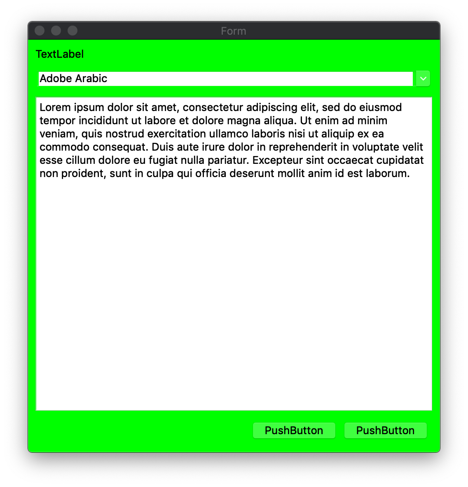
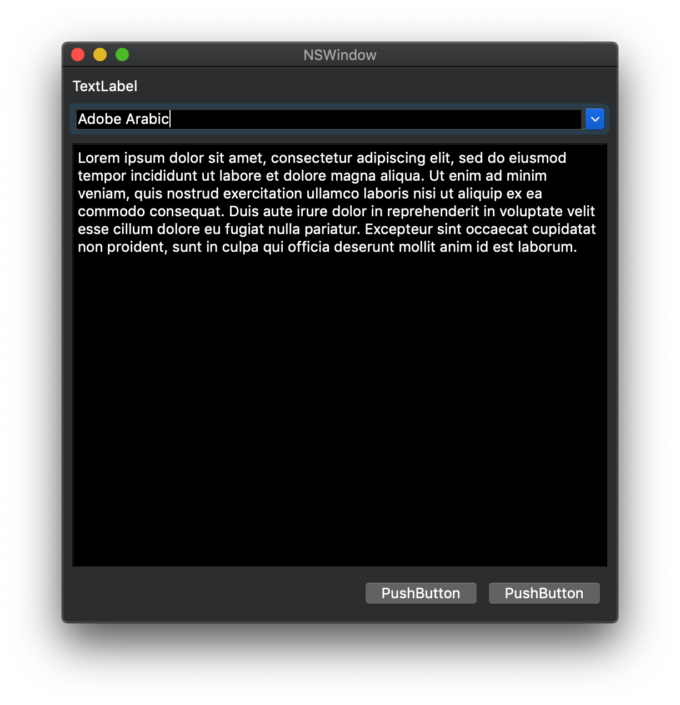

[](https://dev.azure.com/baruchs/qmacnativewidget-setpalette-problem/_build/latest?definitionId=3&branchName=master)

This repository reproduces a problem with the interaction of `QMacNativeWidget` and `QApplication::setPalette()`. 

# UPDATE

The reason changes to the application palette do not affect `QMacNativeWidget` is that its constructor sets the palette explicitly. Once the palette is set explicitly, changes to the application palette no longer propagate through the widget.

The simple solution is to just reset the palette to the default palette by using:

    setPalette( QPalette() );

Once this is done, change to the application palette start affecting the widget and its children.

The new directory `cocoa-ok` contains a working version.

# Build Instructions

    qmake
    make

The result are two applications, one using `QMacNativeWidget` at `cocoa/cocoa.app` and one using pure Qt at `pure-qt/pure-qt.app`. 

# Code

The startup code is taken as-is from the `examples/widgets/mac/qmacnativewidget` sample. The only difference is using a .ui file to construct the UI instead of placing widgets manually.

The widget code is as follows.

```c++
    #pragma once

    #include <QMacNativeWidget>

    #include "ui_form.h"

    class MacNativeForm :
        public QMacNativeWidget
    {
        Q_OBJECT

    public:

        MacNativeForm()
        {
            ui.setupUi(this);
            QApplication::setPalette( QPalette(Qt::red, Qt::green) );
        }

    private:
        
        Ui::Form ui;
    };
```

# Expected Results

Changing the palette changes the appearance of all the widgets.



# Actual Results

Changing the palette does not change the appearance of all the widgets.


